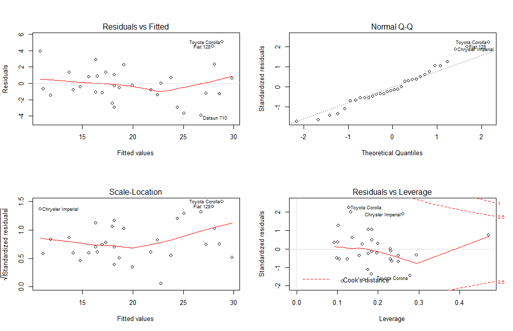
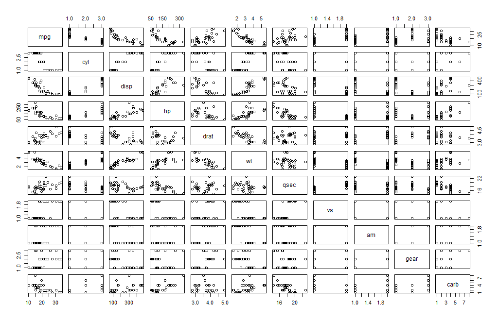
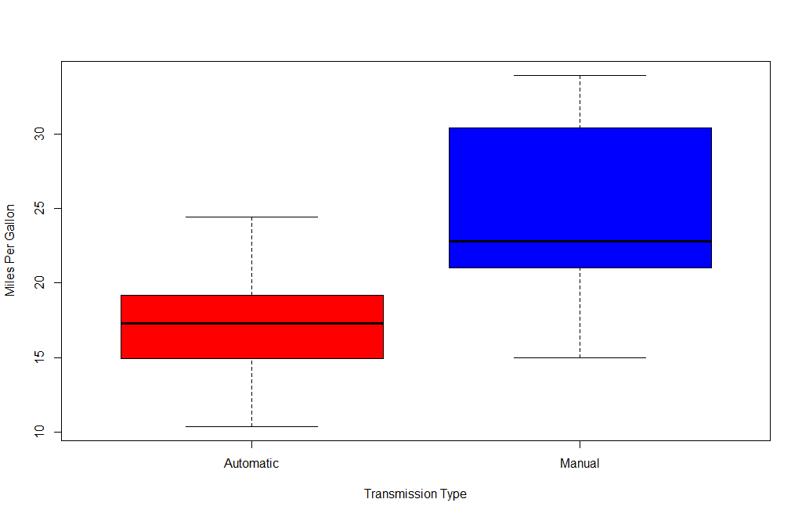

  
## Executive Summary  
Motor Trend, an automobile trend magazine is interested in exploring the relationship between a set of variables and miles per gallon (MPG) outcome. In this project, we will analyze the mtcars dataset from the 1974 Motor Trend US magazine to answer the following questions:

-Is an automatic or manual transmission better for miles per gallon (MPG)?

-How different is the MPG between automatic and manual transmissions?

Using simple linear regression analysis, we determine that there is a signficant difference between the mean MPG for automatic and manual transmission cars. Manual transmissions achieve a higher value of MPG compared to automatic transmission. This increase is approximately 1.8 MPG when switching from an automatic transmission to a manual one, with all else held constant.

## Model Selection
After experimentation, the variables cyl, hp and wt were chosen as variables most associated with the the independent variable selected, am.
```{r}
library(lattice)
data(mtcars)
head(mtcars)
```
```{r}
mtcars$cyl <- factor(mtcars$cyl)
mtcars$vs <- factor(mtcars$vs)
mtcars$gear <- factor(mtcars$gear)
mtcars$am <- factor(mtcars$am, labels = c("Automatic","Manual"))

basemodel <- lm(mpg ~ am, data = mtcars)
model <- lm(mpg ~ cyl + hp + wt + am, data = mtcars)
summary(basemodel)
```
```{r}
summary(model)
```

## Model Residuals and Diagnostics  

In this section, we have the residual plots of our regression model along with computation of regression diagnostics for our liner model. This excercise helped us in examining the residuals and finding leverage points to find any potential problems with the model.

```{r}
par(mfrow = c(2, 2))
plot(model)
```   

From the above graphs, we can make a few observations about the combined model. The randomness of the distribution of the points in the Residuals vs. Fitted graph confirms the variable independence. The linearity of the Normal Q-Q graph indicates that the residuals are distributed under a normal distribution. The labeled points appear to be leverage points above the rest of the points.

## Statistical Inference
  
In this section, we perform a t-test on the two subsets of mpg data: manual and automatic transmission assuming that the transmission data has a normal distribution and tests the null hypothesis that they come from the same distribution. Based on the t-test results, we reject the null hypothesis that the mpg distributions for manual and automatic transmissions are the same.

```{r}
t.test(mpg ~ am, data = mtcars)
```  
From these results, we can reject the null hypothesis saying that the effect on mpg of manual and automatic transmissions are the same.

## Conclusions  


Based on the analysis done in this project, we can conclude that:

- Cars with Manual transmission get 1.8 more miles per gallon compared to cars with Automatic transmission. (1.8 adjusted for hp, cyl, and wt).

- mpg will decrease by 2.5 for every 1000 lb increase in wt.

- mpg decreases negligibly (only 0.32) with every increase of 10 in hp.

- If number of cylinders, cyl increases from 4 to 6 and 8, mpg will decrease by a factor of 3 and 2.2 respectively (adjusted by hp, wt, and am).

  
This model has the Residual standard error as 2.833 on 15 degrees of freedom. And the Adjusted R-squared value is 0.779, which means that the model can explain about 78% of the variance of the MPG variable. However, none of the coefficients are significant at 0.05 significant level.  

## Appendix

###Figure 1 - Pairs plot for the “mtcars” dataset
``` {r}
pairs(mpg ~ ., data = mtcars)
```



###Figure 2 - Boxplot of miles per gallon by transmission type  
```{r}
boxplot(mpg ~ am, data = mtcars, col = (c("red","blue")), ylab = "Miles Per Gallon", xlab = "Transmission Type")
```  


